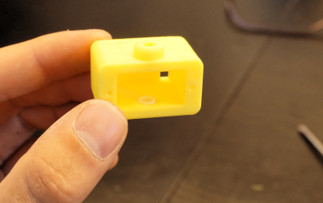

# Arty Bot Assembly Instructions #

This is a quick tutorial on how to assembly the Arty Bot. This is one of the simplistic and most fun robots to build out of the PrintABots collection. The parts for this kit can be obtained from Roboteurs.

- http://roboteurs.com/collections/all/products/printabots-mini-kit

## Kit Requirements ##

- 3 servo motors
- 1 base, 1 carriage, 1 arm, 1 mid arm (All 3d printed)
- 1 pen/markter
- 1 elastic of some tape

### Step 1 - Mount the first servo on the base ###

In this step we will mount the first servo to the printed base part. Only one screw is required to hold the motor in place. Depending on the acscuracy of your printer you may have to apply a bit of force to insert the screw.

### Step 2 - Install arm inside carriage ###

Install the servo arm inside the carriage. If you are having difficulty keeping it in there you can use some tap to hold it in place. Make sure all support material is removed from the area where the arm sits.

### Step 3 - Install the carriage ###

This is probably the most difficult step of assembling the Arty Bot. You must slightly bend the base supports in order to slide the carriage into place. Make sure that your printed parts will fit together before tackling this step.

### Step 4 - Attach the carriage ###

Put the screwdriver through the hole in the end of the carriage and screw in the screw that holds the carriage in place. This step is a bit of a balancing act.

### Step 5 - Install the swing servo ###

Install the servo in the carriage and screw it into place. Note that the servo wire will exit the hole at the bottom of the carriage.

### Step 6 - Install mid arm servo ###

Install the last servo in the end of the mid arm (the long one). Two screws are best to make sure your drawings dont have to much jitter.

### Step 7 - Attach the end arm ###

Attach the end arm to the servo you install in Step 6. Make sure your servo was turned to zero when you installed it.

### Step 8 - Install the arm Assembly ###

This step is the simplest and most rewarding! Install the arm assembly you just made onto the servo inside the carriage. Make sure the servo was turned to zero before screwing into place. Now your robot is fully assembled. Great Work! Time to program it.

## Finished Arty Bot ##

> **Trouble Shooting:**
>- Check that all servo are turned to the zero position before assembling any robot
>- If your 3D printer is over extruding the parts may not fit together well. You can file off extra material to make things fit. Or just be creative!
>- If your parts broke when you where assembling try printing with a higher density
