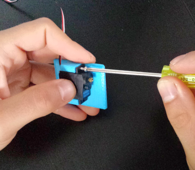
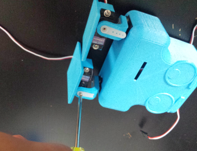

# Arty Bot Assembly Instructions #

This is a quick tutorial on how to assembly the Funny Feet Robot. This is a very enjoyable robot to build and you will have fun making him walk around and do all kinds of silly things.

- http://roboteurs.com/collections/all/products/printabots-mini-kit

## Kit Requirements ##

- 4 servo motors
- 1 body, 2 feet, 2 legs

### Step 1 - Mount the first servo on the foot ###

In this first step we will mount the servo motors to the robot feet. This is done by putting the servo in place and then screwing in the two screws that hold the feet firmly in place. 
### Step 2 - Have both servos mounted on the feet ###

Do this for both feet. Its kinda hard for the robot to walk with one foot. We tried and all he can do is tip over. 

### Step 3 - Mount servo inside the body ###

This step is a bit trick because we have to get some small screws into some tight places. First insert the servo into place. Then put the screw driver through the hole in the top of the body and tighten the screw. 

### Step 4 - Mount both servos to the body ###

Do this for both servos.

### Step 5 - Install the servo swings in the feet ###

Place the pastic servo swings into the feet. These should just sit there lightley for now, they will be fastened in later with screws. These platic parts are designed to lock onto the servo motor. 

### Step 6 - Attach the feet to the body ###

Install the feet to the servos you mounted on the body in step 4. A small screw holds the feet in place, you may now be able to move the leg around. 

### Step 7 - Place plastic servo swings on the legs ###

Now we will mount the servo swings on the other side of the leg in the same way as step 5. These will be used to hold the servos in place. 

### Step 8 - Install the feet ###

Last step! Press the feet onto the plastic servo swings. Then use the small screw to fasten them together. 

## Finished Arty Bot ##

> **Trouble Shooting:**
>- Check that all servo are turned to the zero position before assembling any robot
>- If your 3D printer is over extruding the parts may not fit together well. You can file off extra material to make things fit. Or just be creative!
>- If your parts broke when you where assembling try printing with a higher density or glueing them back together (super glue works great!) 
