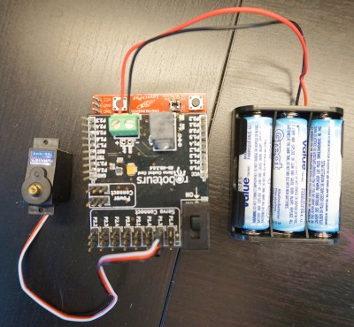
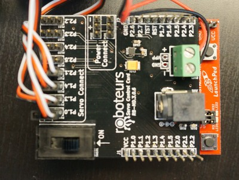
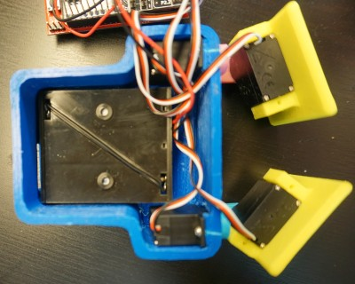

# Funny Feet Programming Instructions#

The Funny Feet robot uses 4 servo motors to move around. This tutorial will cover how to get those motors moving and how you can use them to make the robot walk around. If you like you can copy and paste the sample code into Energia to program the robot. However we recommend working through the tutorial. You will learn lots!

- http://roboteurs.com/collections/all/products/printabots-mini-kit

### Step 1 - Install Energia ###

Energia is the programming environment we will use to program the robot. It works with the Texas Instruments Launchpad boards (the red board included in the kit). The code you will be writing will be in C++. To start we need to download and install Energia.

http://energia.nu/download/

To install Enegria please follow the below links.

>- Windows http://energia.nu/guide/guide_windows/
>- Mac OS X http://energia.nu/guide/guide_macosx/
>- Linux http://energia.nu/guide/guide_linux/

### Step 2 - Blink the LED ###

This step will help make sure that all of your hardware is working and it will give you a bit of practice programming in Energia. You dont need to be a C++ expert to make the robot move around.

1. Open Energia
2. Plug the USB cable into your computer and the other end into the Launchpad
3. In Energia select the board that came with your kit __Tools > Board > MSP430G2553__
4. To verify the board is connected click the __Upload__ button
5. The terminal at the bottom of the program should display that the board has been successfully programmed
6. Enter some code! The below code is based on one of the Energia examples
```cpp
// most launchpads have a red LED and in the case of the MSP430G2553 it is connected to P1.0 or pin 2 of the board
#define LED 2

// the setup routine runs once when you press reset:
void setup() {
  // initialize the digital pin as an output.
  pinMode(LED, OUTPUT);
}

// the loop routine runs over and over again forever:
void loop() {
  digitalWrite(LED, HIGH);   // turn the LED on (HIGH is the voltage level)
  delay(1000);               // wait for a second
  digitalWrite(LED, LOW);    // turn the LED off by making the voltage LOW
  delay(1000);               // wait for a second
}
```

If you entered the code correctly and uploaded it to the Launchpad you should see you LED blinking. Now we can move on to setup the electronics.  


### Step 3 - Wire the Motors ###


The above image shows how we want to connect all the wires to the Launchpad Servo Booster pack. Note that the pins for the servo connection are labeled on the board. These numbers (ie. P1.3) will relate to the pin number on the side of the booster pack. For now we will connect one servo just for practice. Later we will connect the robot motors in the same way.

- connect the servo to P1.3

### Step 4 - Move the servo ###
This is the really fun part! Now we will move the servo using Energia. When we use a servo in Energia we have to do three things.

1. define the servo as a variable ```Servo myservo; ```
2. attach the servo to a pin on the booster pack (attach in software, the hardware is already connected) ```myservo.attach(pin number)```
3. move the servo to some angle ```myservo.write(some angle)```

When we put all of these together we get some simple code that looks like things
```cpp
#include <Servo.h>

Servo myservo;  // create the servo object

void setup()
{
  myservo.attach(5);  // attaches the servo on pin 5 or P1.3
}  

void loop()
{
  myservo.write(90);  //move to the angle 90 degrees
  delay(100);
}
```
If you enter this code into Energia and upload it to the Launchpad you will notice that your servo will quickly move to its middle position and stay there. If you apply a small amount of force to rotate the servo you will notice it fights back at you. You can experiment with different angles using ```servo.write()``` to see the range of the servo.

### Step 5 - Wiring the Robots Motors ###


Next we will install all the servo motors for the robot. To do this we connect them in the same way as before. We are going to use some specific pins that will be used in future projects, however you can use whatever pins you like.

- Right foot: P1.0 (Pin 2)
- Right hip: P1.3 (Pin 5)
- Left foot: P1.4 (Pin 6)
- Left Hip: P2.1 (Pin 9)

### Step 6 - Program the Robot to Walk ###


Programming the robot to walk is a lot of fun. All we have to do is program in a sequence of angles and the servos will move to these angles. If the angles are correct the robot will walk around. When you are creating this sequence of angles think about how the robot might move. There is more than one way to get the robot walking.

>1. angle a foot to lift the robot so it is standing on one leg
>2. rotate the hip to the robot steps forward
>3. lower the angle of the foot so the robot is standing on two feet
>4. repeat this for the other foot

If figuring all this out seems a bit too daunting you can copy and paste the robots sample code instead. This code can be modified to make the robot do all kinds of fun things.


> **Trouble Shooting:**
>- Check that the USB cables are connected correctly
>- The Servo motors will not run of USB power. Make sure the batteries or power supply is connected to the booster pack
>- Check that the servo connector is on the right way
>- If you cant upload try restarting your computer and check over the installation guide to be sure you didnt miss a step
>- Flip the booster pack switch to on or the motors will not get power
